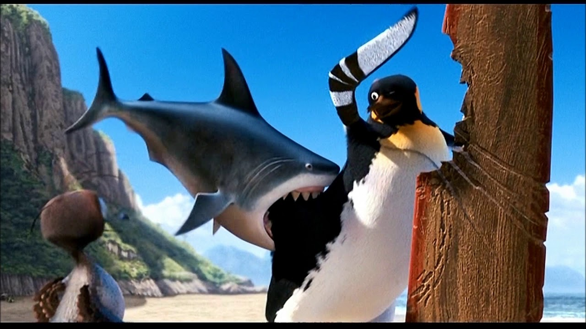
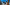
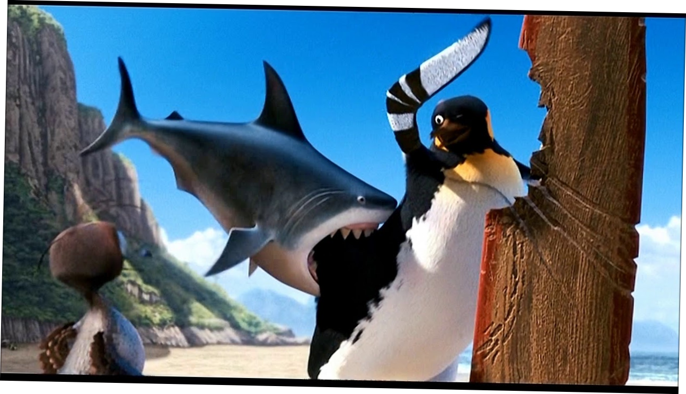
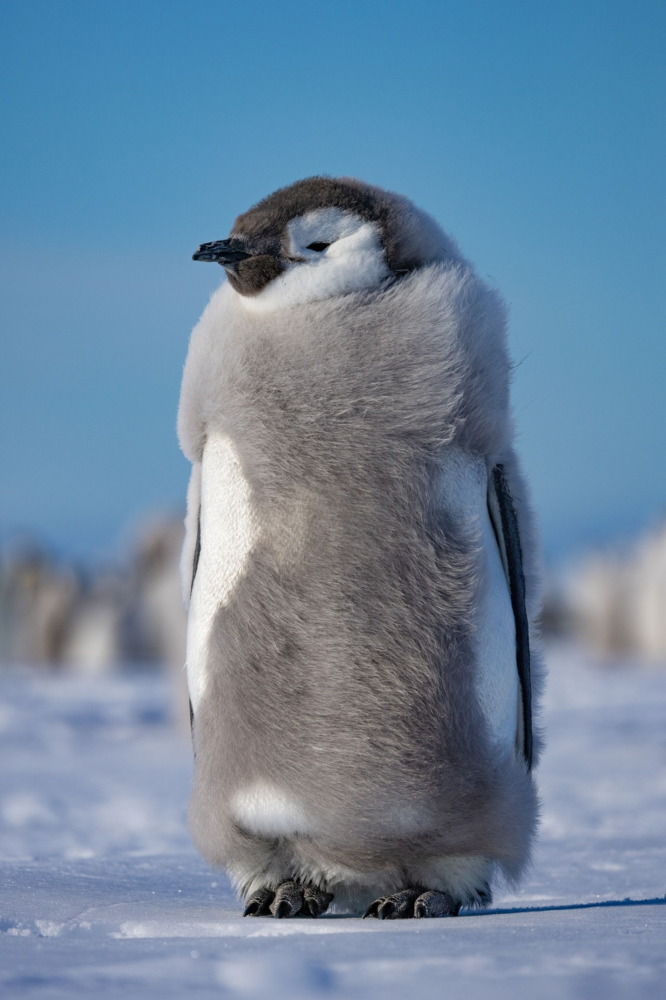
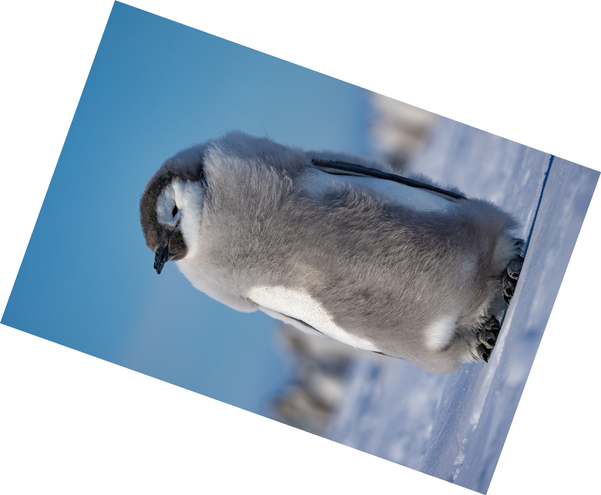
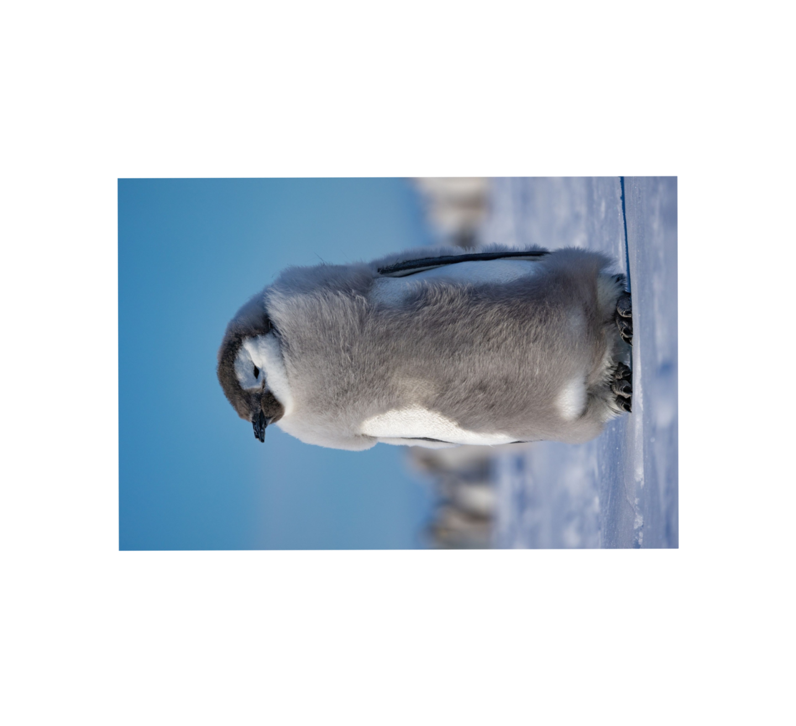
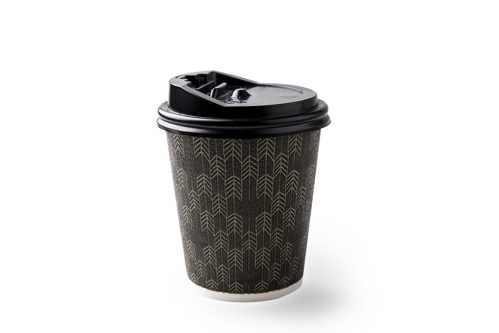
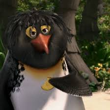
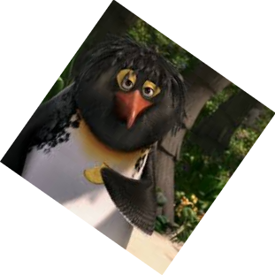
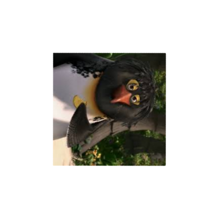

# 🖼️ Processador de Imagens com Rotação e Recorte Automático

Este é um projeto em Python que utiliza as bibliotecas **OpenCV** para processamento de imagem e **Gradio** para criar uma interface web interativa. A ferramenta permite que usuários façam upload de imagens e apliquem diversas transformações, como rotação, redimensionamento e recorte, tanto de forma manual quanto automática.

A aplicação é ideal para tarefas rápidas de edição, como endireitar fotos tortas, recortar objetos de seus fundos ou padronizar o tamanho de um lote de imagens.

## ✨ Funcionalidades Principais

*   **Interface Web Interativa:** Graças ao Gradio, não é necessário ter conhecimento de programação para usar a ferramenta. Basta executar o script e abrir o link no navegador.
*   **Rotação Manual e Automática:**
    *   **Manual:** Um slider permite girar a imagem em qualquer ângulo de -180° a 180°.
    *   **Automática:** Utiliza a Transformada de Hough para detectar as linhas predominantes na imagem e corrigir sua inclinação automaticamente. Possui uma "zona morta" para evitar a rotação desnecessária de imagens que já estão retas.
*   **Redimensionamento com Preservação de Proporção:** Defina a nova largura ou altura em pixels e escolha se deseja manter a proporção original da imagem para evitar distorções.
*   **Múltiplos Métodos de Recorte (ROI):**
    *   **Contorno Retangular:** Detecta o objeto principal na imagem (baseado no contraste com o fundo) e o recorta em uma caixa delimitadora. Ideal para produtos em fundos simples.
    *   **Remoção de Fundo:** Vai um passo além do recorte retangular, criando uma máscara para remover completamente o fundo e torná-lo transparente (requer salvamento em PNG).
*   **Pré-visualização em Tempo Real:** Veja o resultado das suas transformações na interface antes de fazer o download.
*   **Exportação em Múltiplos Formatos:** Baixe a imagem processada nos formatos **PNG** ou **JPG**.

## 📂 Estrutura do Projeto

Este projeto segue uma estrutura modular para facilitar a manutenção e escalabilidade:

```
seu-repositorio/
│
├── image_processor/
│   ├── __init__.py        # Torna a pasta um "pacote" Python
│   ├── processing.py      # Contém toda a lógica de processamento de imagem (OpenCV)
│   └── ui.py              # Contém toda a lógica da interface do usuário (Gradio)
│
├── main.py                # Ponto de entrada principal para iniciar a aplicação
├── requirements.txt       # Lista todas as bibliotecas necessárias para o projeto
└── README.md              # Esta documentação
```

## 🚀 Como Executar

Você pode executar este projeto de duas maneiras: localmente em sua máquina ou diretamente no Google Colab.

### A. Executando Localmente

**Pré-requisitos:**
*   [Git](https://git-scm.com/) instalado.
*   [Python 3.x](https://www.python.org/downloads/) instalado.

**Passos:**

1.  **Clone o repositório:**
    Abra seu terminal e clone este repositório do GitHub.
    ```bash
    git clone https://github.com/LPG6/ProcessamentoImagens_RotacaoRedimencionamento.git
    ```

2.  **Navegue até o diretório do projeto:**
    ```bash
    cd ProcessamentoImagens_RotacaoRedimencionamento
    ```

3.  **Instale as dependências:**
    O arquivo `requirements.txt` contém todas as bibliotecas necessárias. Instale-as com um único comando:
    ```bash
    pip install -r requirements.txt
    ```

4.  **Execute a aplicação:**
    Inicie o script principal.
    ```bash
    python main.py
    ```

5.  **Acesse a interface:**
    O terminal exibirá um URL. Abra este link no seu navegador para usar a ferramenta.

### B. Executando no Google Colab

Esta é a maneira mais fácil de testar o projeto sem precisar instalar nada em sua máquina.

1.  **Abra um novo notebook no Google Colab.**

2.  **Célula 1: Clone o repositório**
    Copie e cole o seguinte comando na primeira célula.
    ```python
    # Clona o seu projeto para o ambiente do Colab
    !git clone https://github.com/LPG6/ProcessamentoImagens_RotacaoRedimencionamento.git
    ```

3.  **Célula 2: Instale as dependências**
    Navegue para a pasta do projeto e instale as bibliotecas a partir do `requirements.txt`.
    ```python
    # Entra na pasta do projeto
    %cd ProcessamentoImagens_RotacaoRedimencionamento

    # Instala todas as bibliotecas necessárias
    !pip install -r requirements.txt
    ```

4.  **Célula 3: Execute a aplicação**
    Inicie o script principal para lançar a interface do Gradio.
    ```python
    # Executa a aplicação
    !python main.py
    ```
    Ao executar esta célula, o Colab fornecerá um **URL público** (`...gradio.live`). Clique nesse link para abrir e usar a ferramenta.

## 🔧 Como Utilizar a Ferramenta

A interface é dividida em um painel de controle à esquerda e uma área de pré-visualização à direita.

1.  **Faça o Upload da Imagem:** Arraste e solte uma imagem ou clique na caixa "Imagem Original" para selecionar um arquivo.
2.  **Ajuste a Rotação (Seção 1):**
    *   **Manual:** Deixe a opção "Manual" selecionada e mova o slider "Ângulo".
    *   **Automática:** Selecione a opção "Automática" para que o script endireite a imagem.
3.  **Escolha o Método de Corte (Seção 2):**
    *   **Nenhum:** Mantém a imagem sem recorte.
    *   **Contorno Retangular:** Ideal para objetos com fundo de alto contraste. Ele recortará um retângulo ao redor do objeto.
    *   **Remoção de Fundo:** Remove o fundo, deixando-o transparente. **Atenção:** Isso forçará o formato de saída para PNG.
4.  **Defina o Redimensionamento (Seção 3):**
    *   Insira a nova largura ou altura desejada em pixels.
    *   Marque/desmarque a caixa "Manter Proporção" conforme sua necessidade.
5.  **Selecione o Formato de Saída (Seção 4):**
    *   Escolha entre PNG (suporta transparência) e JPG.
6.  **Aplique e Baixe:**
    *   Clique no botão **"Aplicar Transformações"**.
    *   A imagem processada aparecerá na área de pré-visualização à direita.
    *   Clique em **"Baixar Imagem Processada"** para salvar o arquivo final.

## ⚙️ Detalhes Técnicos e Depuração

*   **Rotação Automática:** O algoritmo utiliza `cv2.HoughLinesP` para detectar segmentos de linha, calcula a mediana de seus ângulos e aplica uma rotação corretiva.
*   **Detecção de Contornos:** Para os métodos de corte, a imagem é convertida para escala de cinza e binarizada usando o método de Otsu (`cv2.THRESH_OTSU`) para separar o objeto do fundo. Em seguida, `cv2.findContours` localiza a forma do objeto principal (o maior contorno por área).
*   **Depuração:** Durante o processo de remoção de fundo, o script gera automaticamente um arquivo chamado `debug_mascara_gerada.png` na mesma pasta. Este arquivo mostra a silhueta em preto e branco que foi usada para criar a transparência, sendo muito útil para diagnosticar por que um recorte pode não ter saído como o esperado.

## 🧪 Casos de Teste e Demonstração

Esta seção demonstra o comportamento da aplicação em diferentes cenários, destacando suas forças e limitações. Para replicar estes testes, você pode salvar as imagens de exemplo em uma pasta e utilizá-las na ferramenta.

| Cenário de Teste | Imagens de Exemplo (Original → Processada) | Funcionalidades a Utilizar | Resultado e Análise Técnica |
| :--- | :--- | :--- | :--- |
| **1. Redimensionamento Extremo (Downscaling)** |  →  | 1. **Redimensionamento:** Largura = 10px<br>2. **Manter Proporção:** Ativado | **✅ Sucesso (com ressalvas).**<br><br>**Análise:** A funcionalidade operou corretamente, mas o resultado destaca a consequência da perda de dados. A **Perda de Qualidade (SSIM) de 50,23%** é altíssima e esperada, pois reduzir uma imagem a uma largura de 10 pixels descarta uma quantidade massiva de informação. O SSIM mede a similaridade estrutural, que foi drasticamente alterada. A **Nitidez de 189,73** refere-se à imagem original, que é moderadamente nítida. |
| **2. Rotação Automática em Imagem Reta** |  →  | 1. **Rotação:** `Automática` | **⚠️ Falha Parcial (Esperada).**<br><br>**Análise:** A imagem, que já estava reta, foi ligeiramente desalinhada. Isso ocorre porque o algoritmo da Transformada de Hough não analisa apenas o horizonte, mas **todas as linhas** da imagem (contornos do rosto, cabelo, etc.). Se a "mediana" dos ângulos de todas essas linhas não for exatamente zero, o algoritmo aplicará uma "correção" indesejada. É uma limitação clássica da técnica. |
| **3. Erro Cumulativo da Rotação Automática** |  →  →  | 1. **Rotação:** `Automática`<br>2. **Rotação:** `Automática` (aplicada novamente sobre o resultado) | **❌ Falha (Esperada).**<br><br>**Análise:** A primeira rotação falhou porque as linhas verticais fortes do pinguim "enganaram" o algoritmo, fazendo-o pensar que a imagem estava de lado. Ao aplicar a rotação automática **novamente** sobre a imagem já incorreta, o erro foi agravado, resultando em uma rotação de quase 180°. Isso demonstra a falta de compreensão semântica do algoritmo. |
| **4. Perda Irreversível por Redimensionamento** |  →  →  | 1. **Redimensionamento:** Largura = 100px<br>2. **Redimensionamento:** Largura = 1440px (sobre o resultado anterior) | **✅ Sucesso.**<br><br>**Análise:** Este é um teste excelente sobre perda de dados. <br>• **Passo 1 (Downscaling):** A perda de **13,94%** e a queda da nitidez do original (**175,2**) para **118,6** mostram que a informação foi permanentemente perdida. <br>• **Passo 2 (Upscaling):** A perda de apenas **0,4%** é enganosa. O SSIM está comparando a imagem de 100px com a sua versão ampliada (e depois reduzida para comparação), que são estruturalmente idênticas. No entanto, a nitidez final (**118,6**) prova que a qualidade perdida no primeiro passo **nunca foi recuperada**. |
| **5. Rotação Automática em Objeto Vertical** |  →  →  | 1. **Rotação:** `Manual`, Ângulo = 35°<br>2. **Rotação:** `Automática` (sobre o resultado anterior) | **❌ Falha (Esperada).**<br><br>**Análise:** Este teste confirma o problema de **"deskew" vs. "re-orient"**. O objeto "big" (provavelmente Big Ben) tem linhas verticais dominantes (90°). Após a rotação manual de 35°, essas linhas ficaram em ~125°. A rotação automática tentou forçar essas linhas dominantes a ficarem horizontais (0°), resultando em uma rotação massiva e incorreta. A ferramenta não "sabe" que o objeto deve ficar em pé. |
